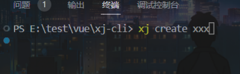

# cxj-cli脚手架

- 版本 1.0.0
- 功能: 支持下载模板 `create` 命令
- 全局命令可使用 `xj`
- 项目技术：VUE3 + TS + Pnina + Vite  [仓库地址](https://github.com/Flower-guest/projectBuildTemplate)

## 使用

目前主要功能为create命令，使用方法类似 vue-cli，具体可以参考图片。

## 采用第三方模块

- [commander](https://github.com/tj/commander.js/blob/master/Readme_zh-CN.md)：命令配置工具
- [chalk](https://github.com/chalk/chalk)：命令行美化工具
- [inquirer](https://github.com/SBoudrias/Inquirer.js)：命令行交互工具
- [loading-cli](https://github.com/jaywcjlove/loading-cli)：命令行 loading 效果
- [fs-extra](https://github.com/jprichardson/node-fs-extra)：更友好的文件操作
- [download-git-repo](https://gitlab.com/flippidippi/download-git-repo)：命令行下载工具

## ⚠️ 注意

- 该模板仓库使用的包管理为pnpm，创建项目前请先安装pnpm，否则会出现依赖安装报错。
